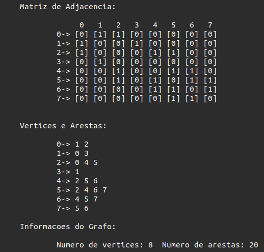
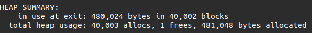

<h1> Estruturas de Grafos e Métodos de Busca </h1>

Gustavo Rodrigues Barcelos

<h2>Compilação</h2>

Os arquivos estão separados em 3 pastas diferentes, todas compilam com o seguinte código:

~~~C
gcc Main.c -o executavel
~~~

<h2>Navegação Rápida</h2>
<a href="#introducao">1. Introdução</a> 
<a href="#resumo">1.1 Breve resumo da teoria de grafos</a>  
<a href="#estrutura">2. Estruturas de Grafos</a> 
<a href="#adj">2.1 Matriz de Adjacência</a> 
<a href="#in-adj">2.1.1 Inputs</a> 
<a href="#cod-adj">2.1.2 Codificação</a> 
<a href="#ex-adj">2.1.3 Execução</a> 
<a href="#inc">2.2 Matriz de Incidência</a> 
<a href="#in-inc">2.2.1 Inputs</a> 
<a href="#cod-inc">2.2.2 Codificação</a> 
<a href="#ex-inc">2.2.3 Execução</a>  
<a href="#busca">3. Métodos de Busca</a> 
<a href="#BFS">3.1 BFS</a> 
<a href="#BFS-ADJ">3.1.1 Alteraçẽos de BFS para Matriz de Adjacência</a> 
<a href="#BFS-INC">3.1.2 Alteraçẽos de BFS para Matriz de Incidência</a> 
<a href="#DFS">3.2 DFS</a> 
<a href="#DFS-ADJ">3.2.1 Alteraçẽos de DFS para Matriz de Adjacência</a> 
<a href="#DFS-INC">3.2.2 Alteraçẽos de DFS para Matriz de Incidência</a> 
<a href="#busc-resul">3.3 Resultados obtidos</a>  
<a href="#Compara">4. Comparações </a> 
<a href="#comp-lis">4.1 Lista de Adjacência:</a> 
<a href="#comp-adj">4.2 Matriz de Adjacência:</a> 
<a href="#comp-inc">4.3 Matriz de Incidência: </a> 
<a href="#com-visual">4.4 Representações visuais dos resultados obtidos:</a>  
<a href="#conclusão">5 Conclusões</a> 
 

<h2 id="introducao">1. Introdução</h2>

A atividade da disciplina: Algoritmos e estrutura de dados II tem como objetivo implementar as estruturas de grafos aprendidas em aula, sendo elas: Listas de Adjacência, Matriz de Adjacência e Matriz de Incidência. Para realização dessa atividade foi disponilizado a implentação do código: "Lista de Adjacência", a fim de servir como base de estudo e referência para implementação dos demais.

<h3 id="resumo">1.1 Breve resumo da teoria de grafos:<a href="#wiki"> [ 1 ]</a></h3>

A teoria dos grafos é um ramo da matemática que estuda as relações entre os objetos de um determinado conjunto. Para tal são empregadas estruturas chamadas de grafos, G(V,E), onde V é um conjunto não vazio de objetos denominados vértices (ou nós) e E (do inglês edges - arestas) é um subconjunto de pares não ordenados de V.

As aplicações relacionadas a teoria de grafos são diversas e estão presentes em basicamente todos os lugares, grafos estão presentes em aparelhos GPS, nos diretórios de um computador, em redes sociais, em um mapa rodoviário, um sistema de distribuição de água ....

Representação Visual:

    

A imagem acima representa um grafo G(6,7). 6 Vértices e 7 arestas

 

<h2 id="estrutura">2. Estruturas de Grafos</h2>

Em computação os grafos podem ser representados de diversas formas, nesse tópico será abordado somente as estruturas implementadas: Matriz de Adjacência e Matriz de Incidência

<h3 id="adj">2.1 Matriz de Adjacência</h3>

Esse tipo de representação consiste em uma matriz N x N ( ADJ[N][N] ), na qual N é o número de vértices do grafo. As posições (i,j) da matriz representam se há ou não ligação entre os vétices indicados. Suponha que exista um grafo G, tal que G contenha pelo menos dois ou mais vértices, um vértice X(origem) e um vértice Y(destino), caso o valor contido na matirz ADJ na posição: ADJ[X][Y] for igual a 1, significa há uma aresta que parte de X e incide em Y.

<h4 id="in-adj">2.1.1 Inputs</h4>

A pasta: <i>Matriz de Adjacencia</i> contém um arquivo nomeado de <i>"input.txt"</i>, que fornece os dados para formação de um grafo. As entradas são organizadas da seguinte forma:

<table align="center">
    <thead>
        <th>Instrução</th>
        <th>Representação</th>
    </thead>
    <tbody>
        <tr>
            <td>A primeira linha indica o número de vértices do grafo</td>
            <td>    </td>
        </tr>
        <tr>
            <td>As demais linhas indicam os vértices e seus vértices adjacentes, começando pelo vértice 0. A segunda linha representa o vértice 0, a terceira o vértice 1....</td>
            <td>    </td>
        </tr>
        <tr>
            <td>   
                As linhas são compostas por colunas e cada coluna indica o vértice adjacente.
            </td>
            <td>    </td>
        </tr>
        <tr>
            <td>
                Todas as linhas são encerradas com o valor -1, esse valor não é computado e serve apenas como referência.
            </td>
            <td>    </td>
        </tr>
    </tbody>
</table>

<ul>
<li>

Conteúdo armazenado em <i>input.txt:</i>

~~~C
8
1 2 -1
0 3 -1
0 4 5 -1
1 -1
2 5 6 -1
2 4 6 7 -1
4 5 7 -1
5 6
~~~

</li>
<li>

Representação visual de <i>input.txt</i>:

    
</li>
</ul>

<h4 id="cod-adj">2.1.2 Codificação</h4>

Os códigos referentes a matriz de adjacência se encontram em: <i>Matriz Adjacencia/Adj.h</i>

A representação dessa estrutura na linguagem C se deu da seguinte forma: 

~~~C
struct  Vertex{             //Estrutura que representa um Vértice
    int value;
};
struct Graph{
    int V;                  //Número de Vértices
    int E;                  //Número de Arestas
    vertex **adj;           //Matriz de Adjacência
};
~~~

A função <i>InitializeGraph(char *adrees)</i>, sofreu algumas pequenas modificações comparadas com a Lista de adjacência. Na estrutura em si, a principal diferença foi no caminhamento entre os vértices adjacentes, o código agora 'caminha' na matriz de adjcência buscando os índices do vértices adjacentes. Além disso a leitura e inserção do arquivo input ocorre nessa etapa.

~~~C
vertex InitializeVertex(int value){
    vertex aux = malloc(sizeof(vertex));
    aux->value = value;
    return aux;
}

graph InitializeGraph(char *adrees){
    FILE  *arq;
    int V;                                                  //Número de Vértices
    int origem = 0, destino;                                //Variáveis auxiliares para leitura de arq
    arq = fopen(adrees,"r");

    /*Verificando se foi possível abrir o arquivo*/
    if (arq == NULL){ printf("Erro: Nao foi possivel abrir o arquivo"); return NULL;}
    
    fscanf(arq,"%d",&V);                                    //Lendo o número de vértices

    graph G = malloc(sizeof(graph));
    G->V = V;                                            
    G->E = 0;
    G->adj = (vertex **)calloc(V,sizeof(vertex));
    for(int i = 0; i < V; i++)
        G->adj[i] = (vertex *)calloc(V,sizeof(vertex));

    for(int i = 0; i < V; i++)
        for(int j = 0; j < V; j++)
            G->adj[i][j] = InitializeVertex(0);             //Atribuindo valores default a matriz

    while (!feof(arq)){                                     //Leitura dos demais dados do arquivo
        if(origem >= V) break;

        fscanf(arq,"%d",&destino);
        if(destino != -1)
            GraphInsert(G,origem,destino);
        else
            origem++;
        
    }
    fclose(arq);
        
    return G;
}
~~~

A função: <i>GraphInsert(graph G, int v1, int v2)</i> insere as arestas ou conexões entre os vértices do grafo. Essa função recebe como parâmetro 2 índices de vértices, v1 indicando a origem e v2 o destino. Se os valores de v1 e v2 forem válidos a matriz ADJ[v1][v2] recebe 1.

~~~C
void GraphInsert(graph G, int v1, int v2){
    vertex origem = InitializeVertex(v1);
    vertex destino = InitializeVertex(v2);

    if( (origem->value >= G->V) || (destino->value >= G->V) ){ printf("\n\nErro, valores incompativeis.\n\n"); return; }
    
    if(G->adj[origem->value][destino->value]->value == 0){
        G->adj[origem->value][destino->value]->value = 1;
        G->E++;
    }

    free(origem);
    free(destino);
}
~~~

Por fim, as funções: <i>PrintMatrix(graph G) e PrintGraph(graph G)</i> fornecem representação dos resultados obtidos:

~~~C
void PrintMatrix(graph G){
    printf("\n\n==================================================================================================");
    printf("\n\n\tMatriz de Adjacencia:\n\n");
    for(int i = 0; i < G->V; i++){
        if(i == 0){
            printf("\t\t    ");
            for(int j = 0; j < G->V; j++)
                printf(" %d  ",j);
            printf("\n");
        }
        printf("\t\t");
        for(int j = 0; j < G->V; j++){
            if(j==0){
                printf("%d-> ",i);
            }
            printf("[%d] ", G->adj[i][j]->value);
        }
        printf("\n");
    }
}
void PrintGraph(graph G){
    printf("\n\n\tVertices e Arestas:\n");
    for(int i = 0; i < G->V; i++){
            printf("\n\t\t%d-> ",i);
        for(int j = 0; j < G->V; j++)
            if(G->adj[i][j]->value == 1)
                printf("%d ",j);
    }
    printf("\n\n\tInformacoes do Grafo:");
    printf("\n\n\t\tNumero de vertices: %d", G->V);
    printf("  Numero de arestas: %d",G->E);
    printf("\n==================================================================================================\n");

}
~~~

<h4 id="ex-adj">2.1.3 Execução</h4>

Ao compilar e executar o código de Matriz Adjacencia epesra-se com a leitura de "input.txt" obtem-se o seguinte resultado:

    

<h3 id="inc">2.2 Matriz de Incidência</h3>

Esse tipo de representação consiste em uma matriz N x M (INC[N][M]), na qual N é o número de vértices e M o número de arestas do grafo. As posições (i,j) da matriz representa se há ou não incidencia da aresta no vétice indicado. Diferente da matriz de ajacência as conxões na matriz de incidência são representadas pelas colunas. Suponha que exista um grafo G, tal que G contenha pelo menos dois ou mais vértices, um vértice X(origem) e um vértice Y(destino), caso haja uma aresta J que parte de X e incide em Y a representação na matriz será indicada da seguinte forma: INC[X][J] = -1 e INC[Y][J] = 1. Dessa forma cada coluna contem somente no máximo 2 valores, -1 para idicar a origem da aresta e 1 para indicar o destino.

<h4 id="in-inc">2.2.1 Inputs</h4>

A pasta: <i>Matriz de Incidencia</i> contém um arquivo nomeado de <i>"input.txt"</i>, que fornece os dados para formação de um grafo. As entradas são organizadas da seguinte forma:

<table align="center">
    <thead>
        <th>Instrução</th>
        <th>Representação</th>
    </thead>
    <tbody>
        <tr>
            <td>A primeira linha indica o número de vértices do grafo seguido do número de arestas</td>
            <td>    </td>
        </tr>
        <tr>
            <td>As demais linhas indicam as arestas do grafo sendo o primeiro número o vértice de origem e o segundo o vértice de destino.</td>
            <td>    </td>
        </tr>
    </tbody>
</table>

<ul>
<li>

Conteúdo armazenado em <i>input.txt:</i>

~~~C
8 20
0 1
0 2
1 3
1 0
2 0
2 4
2 5
3 1
4 2
4 5
4 6
5 2
5 4
5 6
5 7 
6 4
6 5
6 7
7 5
7 6
~~~

</li>
<li>

Representação visual de <i>input.txt</i>:

    
</li>
</ul>

<h4 id="cod-inc">2.2.2 Codificação</h4>

Os códigos referentes a matriz de adjacência se encontram em: <i>Matriz Adjacencia/Adj.h</i>

A representação dessa estrutura na linguagem C se deu da seguinte forma: 

~~~C
struct  Vertex{             //Estrutura que representa um Vértice
    int value;
};
struct Graph{
    int V;                  //Número de Vértices
    int E;                  //Número de Arestas
    vertex **inc;           //Matriz de Incidência
};
~~~

A função <i>InitializeGraph(char *adrees)</i>, sofreu algumas pequenas modificações comparadas com a Lista de adjacência. Na estrutura em si, a principal diferença foi no caminhamento entre os vértices adjacentes, o código agora 'caminha' na matriz de incidência buscando arestas que partem de um vértice e incidem em outro, além de caminhar nas colunas também caminha nas linhas para achar o índice do vértice incidente. Além disso a leitura e inserção do arquivo input ocorre nessa etapa.

~~~C
vertex InitializeVertex(int value){
    vertex aux = malloc(sizeof(vertex));
    aux->value = value;
    return aux;
}

graph InitializeGraph(char *adrees){
    FILE  *arq;
    int V;                                                  //Número de Vértices
    int E;                                                  //Número de arestas
    int inci1 = 0, inci2=0;                                 //Variáveis auxiliares para leitura de arq
    int numAresta = 0;
    arq = fopen(adrees,"r");

    /*Verificando se foi possível abrir o arquivo*/
    if (arq == NULL){ printf("Erro: Nao foi possivel abrir o arquivo"); return NULL;}
    
    fscanf(arq,"%d" "%d",&V,&E);                            //Lendo o número de vértices e arestas

    graph G = malloc(sizeof(graph));
    G->V = V;                                            
    G->E = E;
    G->inc = (vertex **)calloc(V,sizeof(vertex));
    for(int i = 0; i < V; i++)
        G->inc[i] = (vertex *)calloc(E,sizeof(vertex));

    for(int i = 0; i < V; i++)
        for(int j = 0; j < E; j++)
            G->inc[i][j] = InitializeVertex(0);             //Atribuindo valores default a matriz

    while (!feof(arq)){                                     //Leitura dos demais dados do arquivo
        if(inci1 >= V || inci2 >= V) break;
        if(numAresta >= E) break;

        fscanf(arq,"%d" "%d",&inci1, &inci2);
        GraphInsert(G,numAresta,inci1,inci2);
        numAresta++;
        
    }
    fclose(arq);
        
    return G;

}
~~~

A função: <i>GraphInsert(graph G, int aresta, int v1, int v2)</i> insere as origens e destino das arestas do grafo. Suponha que que a aresta 00 tem origem no vértice 1 e destino no vértice 7. Sua representação na matriz(INC) será: INC[1][00] = -1 e INC[7][00] = 1.

~~~C
void GraphInsert(graph G, int aresta, int v1, int v2){
    vertex inci1 = InitializeVertex(v1);
    vertex inci2 = InitializeVertex(v2);

    if( (inci1->value >= G->V) || (inci2->value >= G->V) || (aresta >= G->E) ){ printf("\n\nErro, valores incompativeis.\n\n"); return; }
    
    if(G->inc[inci1->value][aresta]->value == 0){
        G->inc[inci1->value][aresta]->value = -1;
        G->inc[inci2->value][aresta]->value = 1;
    }

    free(inci1);
    free(inci2);
}
~~~

Por fim, as funções: <i>PrintMatrix(graph G) e PrintGraph(graph G)</i> fornecem representação dos resultados obtidos:

~~~C
void PrintMatrix(graph G){
    printf("\n\n==================================================================================================");
    printf("\n\n\tMatriz de Incidencia:\n\n");
    for(int i = 0; i < G->V; i++){
        if(i == 0){
            printf("\t\t    ");
            for(int j = 0; j < G->E; j++)
                printf(" %.2d  ",j);
            printf("\n");
        }
        printf("\t\t");
        for(int j = 0; j < G->E; j++){
            if(j==0){
                printf("%d-> ",i);
            }
            if(G->inc[i][j]->value >= 0) printf("[%.2d] ", G->inc[i][j]->value);
            else printf("[%d] ", G->inc[i][j]->value);
             
        }
        printf("\n");
    }
}
void PrintGraph(graph G){
    printf("\n\n\tVertices e Arestas:\n");
    
    for(int i = 0; i < G->V; i++){
            printf("\n\t\t%d-> ",i);
        for(int j = 0; j < G->E; j++)
            if(G->inc[i][j]->value == -1)
                printf("%d ",j);
    }
    printf("\n\n\tInformacoes do Grafo:");
    printf("\n\n\t\tNumero de vertices: %d", G->V);
    printf("  Numero de arestas: %d",G->E);
    printf("\n==================================================================================================\n");

}
~~~

<h4 id="ex-inc">2.2.3 Execução</h4>

Ao compilar e executar o código de Matriz Adjacencia epesra-se com a leitura de "input.txt" obtem-se o seguinte resultado:

    

 
<h2 id="busca">3. Métodos de Busca</h2>

Um algoritmo de busca (ou de varredura) é qualquer algoritmo que visita todos os vértices de um grafo andando pelos arcos de um vértice a outro.  Há muitas maneiras de fazer uma tal busca.  Cada algoritmo de busca é caracterizado pela ordem em que visita os vértices.<a href="#imi">[ 2 ]</a>

<h3 id="BFS">3.1 BFS <a href="bf">[3]</a></h3>

A implementação do algoritmo BFS coloca cada vértice do gráfo em uma de tres categorias:

<ul>
    <li>-1 -> Visitado (preto)</li>
    <li>0  -> Não visitado (branco)</li>
    <li>1  -> Em análise (Cinza)</li>
</ul>

O objetivo do algoritmo é marcar cada vértice como visitado, evitando ciclos. O algoritmo funciona da seguinte maneira: 

<ol>
    <li>Define a cor branca para todos os vértices.</li>
    <li>Começa adicionando qualquer um dos vértices do gráfico no final de uma fila "em análise" e altera sua cor para cinza.</li>
    <li>Pegue o item da frente da fila e adiciona-o à lista de vértices visitados.</li>
    <li>Adiciona os vértices ajacentes ao vértice adicionado a lista de visitados na fila "em análise"</li>
    <li>Continua repetindo as etapas 2 e 3 até que a fila esteja vazia.</li>
    <li>Ao final da chamada recursiva altera a cor do vértice analisado para preto.</li>
</ol>
<h3 id="BFS-ADJ">3.1.1 Alteraçẽos de BFS para Matriz de Adjacência</h3>

As alterações realizadas no método BFS, comparando com o método de Lista de Adjacencia foram poucas. Dentro do laço While, para percorrer os vértices adjacentes agora é necessário um laço for que caminha nas colunas da matriz adj:

~~~C
void BFS(graph G, vertex v){
    int cor[G->V];          // -1 = Preto, 0 = Branco, 1 = Cinza
    int d[G->V];
    int pi[G->V];
    Fila *f =FFVazia();

    printf("\n\n\tMetodo de busca BFS: \n");
    for(int i = 0; i < G->V; i++)
        if(i != v->value){
            cor[i] = 0;
            d[i] = -1;      //Infinito
            pi[i] = -1;
        }
    cor[v->value] = 1;
    d[v->value] = 0;
    pi[v->value] = -1;

    Queue(f,v->value);

    while(f->size > 0){
        Item *aux = Dequeue(f);
        for(int i = 0; i < G->V; i++){
            if(G->adj[aux->data][i]->value == 1)
                if(cor[i] == 0){
                    cor[i] = 1;
                    d[i] = d[aux->data]+1;
                    pi[i] = aux->data;
                    Queue(f,i);
                }
        }
        cor[aux->data] = -1;
        printf("\n\t\tVertice:%d", aux->data);
    }
}
~~~

<h3 id="BFS-INC">3.1.2 Alteraçẽos de BFS para Matriz de Incidência</h3>

A alteração realizada nesse método também se deu no laço while, para acessar os vértices adjacentes agora é preciso de dois laços for. Um para caminhar nas colunas da matriz INC e achar uma aresta que tenha origem no vértice analisado e outro para caminha nas linhas da matriz e encontrar o vértice de destino.

~~~C
void BFS(graph G, vertex v){
    int cor[G->V];          // -1 = Preto, 0 = Branco, 1 = Cinza
    int d[G->V];
    int pi[G->V];
    Fila *f =FFVazia();

    printf("\n\n\tMetodo de busca BFS: \n");
    for(int i = 0; i < G->V; i++)
        if(i != v->value){
            cor[i] = 0;
            d[i] = -1;      //Infinito
            pi[i] = -1;
        }
    cor[v->value] = 1;
    d[v->value] = 0;
    pi[v->value] = -1;

    Queue(f,v->value);

    while(f->size > 0){
        Item *aux = Dequeue(f);
        int aux2;
        for(int i = 0; i < G->E; i++){
            if(G->inc[aux->data][i]->value == -1)
                for(int aux2 = 0; aux2 < G->V; aux2++)
                    if(G->inc[aux2][i]->value == 1)
                        if(cor[aux2] == 0){
                            cor[aux2] = 1;
                            d[aux2] = d[aux->data]+1;
                            pi[aux2] = aux->data;
                            Queue(f,aux2);
                        }
        }
        cor[aux->data] = -1;
        printf("\n\t\tVertice:%d", aux->data);
    }
}
~~~

<h3 id="DFS">3.2 DFS</h3>

A implementação do algoritmo DFS coloca cada vértice do gráfo em uma de tres categorias:

<ul>
    <li>-1 -> Visitado (preto)</li>
    <li>0  -> Não visitado (branco)</li>
    <li>1  -> Em análise (Cinza)</li>
</ul>

O objetivo do algoritmo é marcar cada vértice como visitado, evitando ciclos.
 O algoritmo DFS funciona da seguinte maneira:

<ol>
    <li>Muda para branco a cor de todos os vértices</li>
    <li>A partir de um vértice, muda sua cor para cinza e parte para o primeiro vértice adjacente de cor branca.</li>
    <li>Repetir o passo o 2 até que não haja mais vértices ajcentes de cor branca</li>
    <li>Altera a cor do vértice encontrado no passo 3 para preto, retorna ao pai desse vértice e repete os passos 2 e 3.</li>
    <li>Repetir o passo 4 até que todos os vértices estejam pretos.</li>
</ol>
<h3 id="DFS-ADJ">3.2.1 Alteraçẽos de DFS para Matriz de Adjacência</h3>

Comparado com a função DFS de lista de adjacência a alteração se deu na função: DFS_VISIT(). Para percorrer os vértices adjacentes precisa agora caminhar pelaS colunas da matriz adj.

~~~C
void DFS(graph G){
    printf("\n\n\tMetodo de busca DFS: \n");
    int cor[G->V];                                      //-1 = Preto; 0 = Branco; 1 = Cinza
    int d[G->V];                                        //Tempo de deslocação
    int f[G->V];                                        //Tempo de Finalização
    int tempo = 0;

    for(int i = 0; i < G->V; i++)   cor[i] = 0;         //Branco para todos os vértices

    for(int i = 0; i < G->V; i++)
        if(cor[i] == 0)
            DFS_VISIT(G,i,cor,d,f,&tempo);

}
void DFS_VISIT(graph G, int indice, int *cor, int *d, int *f, int *tempo){
    cor[indice]     = 1;
    *tempo          +=1;
    d[indice]       = *tempo;

    for(int aux = 0; aux < G->V; aux++)
        if(G->adj[indice][aux]->value == 1)
            if(cor[aux] == 0)
                DFS_VISIT(G, aux, cor, d, f, tempo);
    
    cor[indice]     = -1;
    *tempo          += 1;
    f[indice]       = *tempo;

    printf("\n\t\tVertice:%d D:%d, F:%d ", indice, d[indice], f[indice]);
}

~~~

<h3 id="DFS-INC">3.2.2 Alteraçẽos de DFS para Matriz de Incidência</h3>

As alterações aqui também se resumem a função: DFS_VISIT(), para percorrer os vértices adjacentes foram inclusos dois laços for. Um para caminhar nas colunas da matriz INC e achar uma aresta que tenha origem no vértice analisado e outro para caminha nas linhas da matriz e encontrar o vértice de destino. 

~~~C
void DFS(graph G){
    printf("\n\n\tMetodo de busca DFS: \n");
    int cor[G->V];                                      //-1 = Preto; 0 = Branco; 1 = Cinza
    int d[G->V];                                        //Tempo de deslocação
    int f[G->V];                                        //Tempo de Finalização
    int tempo = 0;

    for(int i = 0; i < G->V; i++)   cor[i] = 0;         //Branco para todos os vértices

    for(int i = 0; i < G->V; i++)
        if(cor[i] == 0)
            DFS_VISIT(G,i,cor,d,f,&tempo);

}
void DFS_VISIT(graph G, int indice, int *cor, int *d, int *f, int *tempo){
    cor[indice]     = 1;
    *tempo          +=1;
    d[indice]       = *tempo;

    for(int aux = 0; aux < G->E; aux++)
        if(G->inc[indice][aux]->value == -1)
            for(int aux2 = 0; aux2 < G->V; aux2++)
                if(G->inc[aux2][aux]->value == 1)
                    if(cor[aux2] == 0)
                        DFS_VISIT(G, aux2, cor, d, f, tempo);
    
    cor[indice]     = -1;
    *tempo          += 1;
    f[indice]       = *tempo;

    printf("\n\t\tVertice:%d D:%d, F:%d ", indice, d[indice], f[indice]);
 
}
~~~

<h3 id="busc-resul">3.3 Resultados obtidos</h3>

Como o grafo inserido nos dois casos é o mesmo os resultados obtidos também serão iguais:

    

<h2 id="Compara">4. Comparações </h2>

A atividade contempla uma comparação entre os métodos de busca e as estruturas apresentadas. Para isso fora realizado testes com grafos esparsos com cerca de 100 vértices e grafos densos com cerca de 10000 vértices. As comparações serão baseadas em tempo para execução e consumo de memória RAM de cada estrutura. A codificação para gerar as entradas aleatórias de grafos para as funções se encontram no main de cada uma. Para realizar medições de tempo foi usada as funções da biblioteca: < time.h > e para medir o consumo de memória RAM utilizou-se o seguinte comando no terminal:

~~~C
valgrind --leak-check=yes ./teste
~~~

Os Resultados obtidos foram:

<h3 id="comp-lis">4.1 Lista de Adjacência: </h3>
<h4 id="list-esp">Grafos esparsos:</h4>
<ul>
    <li>O tempo de execução foi: 3.563000 milissegundos</li>
    <li>O espaço em memória gasto foi: 4.432 bytes
        

            
        

    </li>
</ul>
<h4 id="list-den">Grafos Densos:</h4>
<ul>
    <li>O tempo de execução foi: 75.513000 milissegundos</li>
    <li>O espaço em memória gasto foi: 480,024 bytes
        

            
        

    </li>
</ul>
<h3 id="comp-adj">4.2 Matriz de Adjacência: </h3>
<h4 id="adj-esp">Grafos esparsos:</h4>
<ul>
    <li>O tempo de execução foi: 1.987000 milissegundos</li>
    <li>O espaço em memória gasto foi: 196,424 bytes
        

            
        

    </li>
</ul>
<h4 id="list-den">Grafos Densos:</h4>
<ul>
    <li>O tempo de execução foi: 1918.756000 milissegundos</li>
    <li>O espaço em memória gasto foi: 784,069,000 bytes
        

            
        

    </li>
</ul>
<h3 id="comp-inc">4.3 Matriz de Incidência: </h3>
<h4 id="inc-esp">Grafos esparsos:</h4>
<ul>
    <li>O tempo de execução foi: 5.368000 milissegundos</li>
    <li>O espaço em memória gasto foi: 530,536 bytes
        

            
        

    </li>
</ul>
<h4 id="list-den">Grafos Densos:</h4>
<ul>
    <li>O tempo de execução foi: 7932.338000 milissegundos</li>
    <li>O espaço em memória gasto foi: 1,120,057,672 bytes
        

            
        

    </li>
</ul>

<h3 id="com-visual">4.4 Representações visuais dos resultados obtidos: </h3>
<h4>Tempo e consumo de meória em grafos esparsos: </h4>
<table align="center">
   <thead>
       <td></td>
       <th>Lista de Adjacência</th>
       <th>Matriz de Adjacência</th>
       <th>Matriz de Incidência</th>
   </thead> 
   <tbody>
       <tr>
            <th>Tempo gasto</th>
            <td>75.513000 milissegundos</td>
            <td>1918.756000 milissegundos</td>
            <td>7932.338000 milissegundos</td>
        </tr>
        <tr>
            <th>Espaço utilizado</th>
            <td>480,024 bytes</td>
            <td>784,069,000 bytes</td>
            <td>1,120,057,672 bytes</td>
        </tr>

   </tbody>
</table>
 

<ul>
    <li>Tempo
        

            
        

    </li>
    <li>Memória
    

        
    

    </li>
</ul>

<h4>Tempo e consumo de meória em grafos Densos: </h4>
<table align="center">
   <thead>
       <td></td>
       <th>Lista de Adjacência</th>
       <th>Matriz de Adjacência</th>
       <th>Matriz de Incidência</th>
   </thead> 
   <tbody>
       <tr>
            <th>Tempo gasto</th>
            <td>3.563000 milissegundos</td>
            <td>1.987000 milissegundos</td>
            <td>5.368000 milissegundos</td>
        </tr>
        <tr>
            <th>Espaço utilizado</th>
            <td>4.432 bytes</td>
            <td>196,424 bytes</td>
            <td>530,536 bytes</td>
        </tr>

   </tbody>
</table>
 

<ul>
    <li>Tempo
        

            
        

    </li>
    <li>Memória
    

        
    

    </li>
</ul>

<h2 id="conclusão">5 Conclusão</h2>

Analisando os resultados obtidos percebe-se que para grandes entradas de dados é muito viável utilizar Listas de adjacência e vasicamente inviável a utilização de matrizes de incidência. Já para pequenas entradas de dados é mais vantajoso matriz de adjacência, pelo se baixo consumo de memória, a diferênça de tempo é basicamente imperceptível.

A única estrutura que não se mostrou muito vantajosa em nunhum caso foi a matriz de incidência, em todos os casos ela apresenta piores resultados

<h2>Referências</h2>
[1] <a id="wiki" href="https://pt.wikipedia.org/wiki/Teoria_dos_grafos#Hist%C3%B3rico">Wikipedia</a> 
[2]<a id="imi" href="https://www.ime.usp.br/~pf/algoritmos_para_grafos/aulas/dfs.html#:~:text=Um%20algoritmo%20de%20busca%20(ou,em%20que%20visita%20os%20v%C3%A9rtices."> Ime.Usp</a> 
[3] <a id="bf" href="https://www.programiz.com/dsa/graph-bfs">BFS</a>